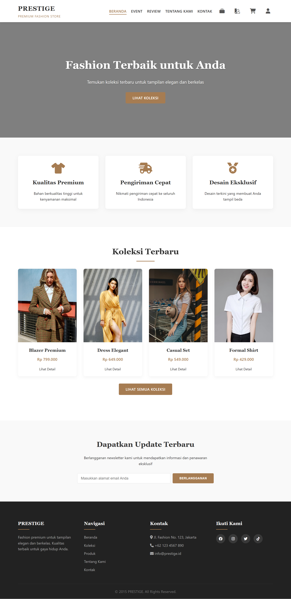

# Toko Baju Online - PRESTIGE

Website toko baju online premium, dibuat menggunakan HTML, CSS, dan JavaScript dengan Bootstrap. Website ini mencakup fitur lengkap seperti katalog produk, keranjang belanja, checkout, halaman akun pengguna, serta fitur tambahan seperti event, lookbook, style guide, review produk, dan inspirasi fashion.

## Fitur Utama

### Halaman Dasar
- **Beranda (`index.html`)**: Menampilkan highlight produk dan navigasi utama.
- **Halaman Produk (`produk.html`)**: Daftar semua produk yang tersedia.
- **Keranjang Belanja (`keranjang.html`)**: Menampilkan produk yang ditambahkan ke keranjang.
- **Checkout (`checkout.html`)**: Formulir pengisian data pengiriman dan pembayaran.
- **Login & Daftar (`login.html`, `daftar.html`)**: Autentikasi pengguna.
- **Akun (`account.html`)**: Informasi akun pengguna.
- **Kontak (`kontak.html`)**: Informasi kontak toko.
- **Tentang Kami (`tentang-kami.html`)**: Informasi tentang toko.
- **Koleksi (`koleksi.html`)**: Menampilkan kategori atau koleksi produk tertentu.

### Halaman Tambahan
- **Event (`event.html`)**: Informasi acara offline/online seperti launching produk dan bazaar.
- **Lookbook (`lookbook.html`)**: Galeri gaya berpakaian dengan preview gambar dan caption.
- **Style Guide (`style-guide.html`)**: Tips berpakaian untuk berbagai kesempatan.
- **Review Produk (`review-produk.html`)**: Ulasan produk dari pelanggan dengan rating dan komentar.
- **Inspirasi (`inspirasi.html`)**: Konten inspiratif seperti video outfit, foto pelanggan, dan rekomendasi mingguan.

## Komponen Bootstrap yang Digunakan

### event.html
- **Carousel**: Menampilkan slide acara utama dengan kontrol navigasi
- **Cards**: Menampilkan informasi acara dalam format terstruktur
- **Grid Layout**: Sistem grid responsif untuk tata letak
- **Badges**: Label untuk kategori atau status acara

### lookbook.html
- **Modal**: Preview gambar dengan tampilan lightbox
- **Grid System**: Layout galeri gambar responsif
- **Cards**: Menampilkan item lookbook dengan gambar dan caption

### style-guide.html
- **Accordion**: Komponen yang dapat dibuka/tutup untuk tips berpakaian
- **Badges**: Menandai tingkat kepentingan tips
- **Cards**: Menampilkan kategori style dengan gambar dan deskripsi

### review-produk.html
- **Cards**: Menampilkan review produk dengan foto, rating, dan komentar
- **Form Controls**: Filter dan pencarian review
- **Dropdown**: Filter review berdasarkan kategori atau rating
- **Pagination**: Navigasi antar halaman review

### inspirasi.html
- **Embed Video**: Responsive video embedding
- **Grid System**: Layout galeri foto dan konten inspirasi
- **Cards**: Menampilkan rekomendasi dan video inspirasi
- **Form Controls**: Newsletter subscription

## Struktur Proyek

```
toko-baju/
├── index.html
├── produk.html
├── keranjang.html
├── checkout.html
├── login.html
├── daftar.html
├── account.html
├── kontak.html
├── tentang-kami.html
├── koleksi.html
├── event.html           # Halaman baru
├── lookbook.html        # Halaman baru
├── style-guide.html     # Halaman baru
├── review-produk.html   # Halaman baru
├── inspirasi.html       # Halaman baru
├── page css/
│   ├── account.css
│   ├── checkout.css
│   ├── daftar.css
│   ├── dropdown.css
│   ├── index.css
│   ├── keranjang.css
│   ├── koleksi.css
│   ├── kontak.css
│   ├── login.css
│   ├── produk.css
│   ├── tentang-kami.css
│   ├── event.css        # CSS baru
│   ├── lookbook.css     # CSS baru
│   ├── style-guide.css  # CSS baru
│   ├── review-produk.css # CSS baru
│   └── inspirasi.css    # CSS baru
├── script/
│   ├── checkout.js
│   ├── daftar.js
│   ├── dropdown.js
│   ├── keranjang.js
│   └── login.js
├── css/
│   ├── bootstrap-grid.css
│   ├── bootstrap-grid.css.map
│   ├── bootstrap-grid.min.css
│   ├── bootstrap-grid.min.css.map
│   ├── bootstrap-grid.rtl.css
│   ├── bootstrap-grid.rtl.css.map
│   ├── bootstrap-grid.rtl.min.css
│   ├── bootstrap-grid.rtl.min.css.map
│   ├── bootstrap-reboot.css
│   ├── bootstrap-reboot.css.map
│   ├── bootstrap-reboot.min.css
│   ├── bootstrap-reboot.min.css.map
│   ├── bootstrap-reboot.rtl.css
│   ├── bootstrap-reboot.rtl.css.map
│   ├── bootstrap-reboot.rtl.min.css
│   ├── bootstrap-reboot.rtl.min.css.map
│   ├── bootstrap-utilities.css
│   ├── bootstrap-utilities.css.map
│   ├── bootstrap-utilities.min.css
│   ├── bootstrap-utilities.min.css.map
│   ├── bootstrap-utilities.rtl.css
│   ├── bootstrap-utilities.rtl.css.map
│   ├── bootstrap-utilities.rtl.min.css
│   ├── bootstrap-utilities.rtl.min.css.map
│   ├── bootstrap.css
│   ├── bootstrap.css.map
│   ├── bootstrap.min.css
│   ├── bootstrap.min.css.map
│   ├── bootstrap.rtl.css
│   ├── bootstrap.rtl.css.map
│   ├── bootstrap.rtl.min.css
│   ├── bootstrap.rtl.min.css.map
├── js/
│   ├── bootstrap.bundle.js
│   ├── bootstrap.bundle.js.map
│   ├── bootstrap.bundle.min.js
│   ├── bootstrap.bundle.min.js.map
│   ├── bootstrap.esm.js
│   ├── bootstrap.esm.js.map
│   ├── bootstrap.esm.min.js
│   ├── bootstrap.esm.min.js.map
│   ├── bootstrap.js
│   ├── bootstrap.js.map
│   ├── bootstrap.min.js
│   ├── bootstrap.min.js.map
└── images/      # Gambar produk dan aset lainnya
```

## Cara Menjalankan

1. Clone repositori ini ke direktori lokal.
2. Buka file `index.html` menggunakan browser.

## Demo

Lihat demo proyek secara langsung di:
[http://apakahbisa.rf.gd](http://apakahbisa.rf.gd)

## Cuplikan Tampilan

Berikut adalah salah satu tampilan dari halaman website:



## Ringkasan Kode

### 🔧 JavaScript
- **checkout.js**: Menampilkan daftar kota secara dinamis berdasarkan provinsi yang dipilih pengguna.
- **daftar.js**: Mengatur visibilitas password saat pendaftaran.
- **dropdown.js**: Menampilkan menu dropdown akun pengguna.
- **keranjang.js**: Logika tambah/kurang jumlah barang.
- **login.js**: Fungsi serupa daftar.js untuk form login.

### 🎨 CSS
- **account.css**, **checkout.css**, **daftar.css**: Gaya khusus masing-masing halaman.
- **dropdown.css**: Dropdown menu akun.
- **index.css**: Tampilan utama beranda.
- **keranjang.css**, **produk.css**, **koleksi.css**, **kontak.css**, **tentang-kami.css**: Gaya halaman lain.
- **event.css**: Styling untuk halaman event dengan carousel dan card.
- **lookbook.css**: Styling untuk galeri lookbook dengan modal dan grid.
- **style-guide.css**: Styling untuk accordion dan badges pada style guide.
- **review-produk.css**: Styling untuk card review dan rating system.
- **inspirasi.css**: Styling untuk grid layout dan embedded video.

## Fitur Responsif

Semua halaman dirancang dengan pendekatan mobile-first dan responsif di berbagai ukuran layar:
- **Mobile**: Tampilan optimal untuk layar kecil dengan menu hamburger
- **Tablet**: Layout yang menyesuaikan untuk layar menengah
- **Desktop**: Tampilan penuh dengan navigasi horizontal

## Catatan

- Proyek ini bersifat statis dan tidak menggunakan backend.
- Untuk fungsionalitas dinamis (login, keranjang, checkout),
- Semua halaman baru terintegrasi dengan navbar utama dan footer untuk navigasi yang konsisten.

**Dibuat oleh:** [emyuel]
